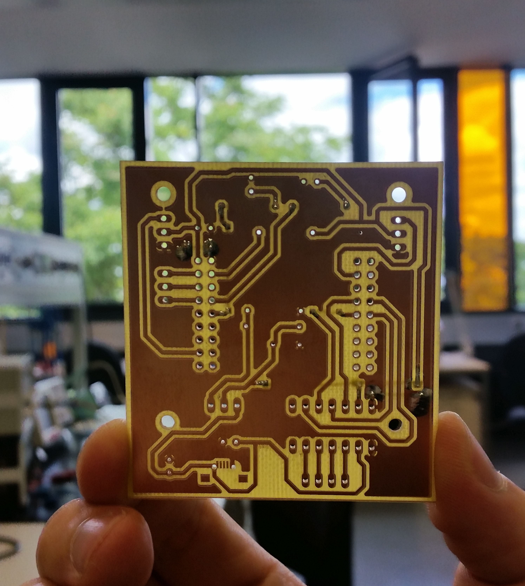

# Eagle files for PCB!

# Pinmap: 

# Schematic

# Final PCB

# Physical PCB

# Physical Board

## Known bug:
  1. Have to add some transistors to schematic to prevent one of the motors from rotating!!!