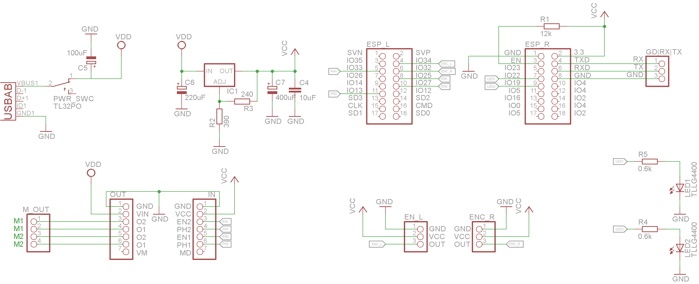
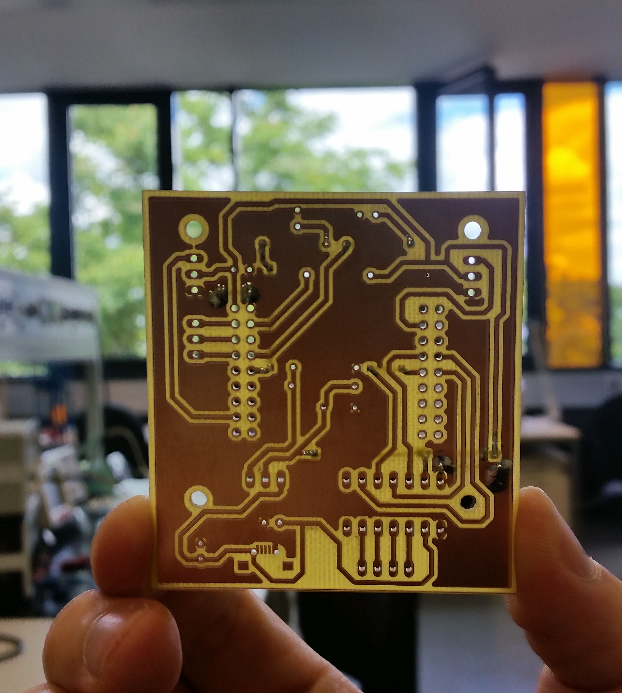

# Eagle files for PCB!

# Pinmap: 

# Schematic

# Final PCB

# Physical PCB

# Physical Board

## Tip:
  1. You can add an heat sink in case LM317 Voltage Regulator is getting hot.

## Known bug:
