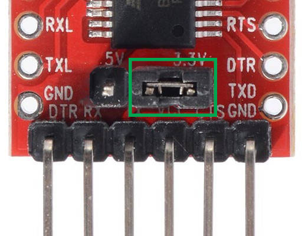

# Firmware

## 1. Connection

Debugging and firmware uploading share the same connection. No matter if you want to debug or to upload a new version of firmware, connection instructions are the same, always!

The connection to car is via Serial port with a baud rate of **115200**. The other settings are default and should not be changed.

Usually the computer already comes with serial ports **BUT** it's logic level is 0-5V which makes it incompatible with the designed car as it equire 0-3.3V as operable logical levels.

In order to do this, it's recommended to use a serial adapter such as the following one: 

WARNING: Don't forget to set juper on 3.3V, as in picture:

Don't forget also about mini USB cable used to connect adapter to computer:

And the witing should looks like this:

The pins which shuld be connected in this order to debugging port:

**Adapter -> Car**
RX -> PIN 1
TX -> PIN 2
GND -> PIN 3

Not that we have everything connected, we have two powwibilities: debug or upload firmware

## 2. Debugging 

To receive debugging data, we'll use PuTTy application: http://www.putty.org/
Download and install application.

Open application, select Serial port, set boud rate to 115200 then click open.
PS: Under linux, launch putty from terminal with sudo permission ($ sudo putty) and use port name **/dev/ttyUSB0**.
PS1: If you have other serial devices connected, you may have to change it to the correct one. On windows COM1 -> COM2 and on Linux /dev/ttyUSB0 -> /dev/ttyUSB1

After putty launches a new terminal, press reset button from top of the care and the terminal will display current state of car:

Now connect to car from regullar application and terminal will display data every 0.5 seconds in the following format:
 \<SIDE\>: steps/\<time\> (\<analogic_output\>) Count: <counted_steps>

Example: R: 3/t (3400) Count: 133 -> right right wheel speed is 3/t and have counted till reset a number of 133 steps.

Now you can rotate the wheels and check the accuracy of sensors or if sensors are working as expected!

If you need to recalibrate sensors, the c++ file **QRE1113_Driver.h** from *Arduino/ControlDeveloper_ESP32Wroom* folder according to it's documentation.

## 3. Uploading new firmware

It's the same procedure as uploading code to ESP32-Wroom board.

1. You'll need to install the following softwares:

     a. Arduino IDE: https://www.arduino.cc/en/Main/Software
     b. ESP32 Support: https://github.com/espressif/arduino-esp32/blob/master/doc/windows.md
 
2. Now open .ino file from *Arduino/ControlDeveloper_ESP32Wroom* with Arduino IDE.
3. Configure IDE:

     a. Select the correct serial port: Tools -> Port
     b. From Tools >> Board select **FireBeetle-ESP32**
     c. Tools >> Flash Freq -> 80MHz, Upload speed -> 921600
  
4. Click un upload button.

At this point, the bottom console will display messages regarding progress and whether operation succeed or fail.
 

