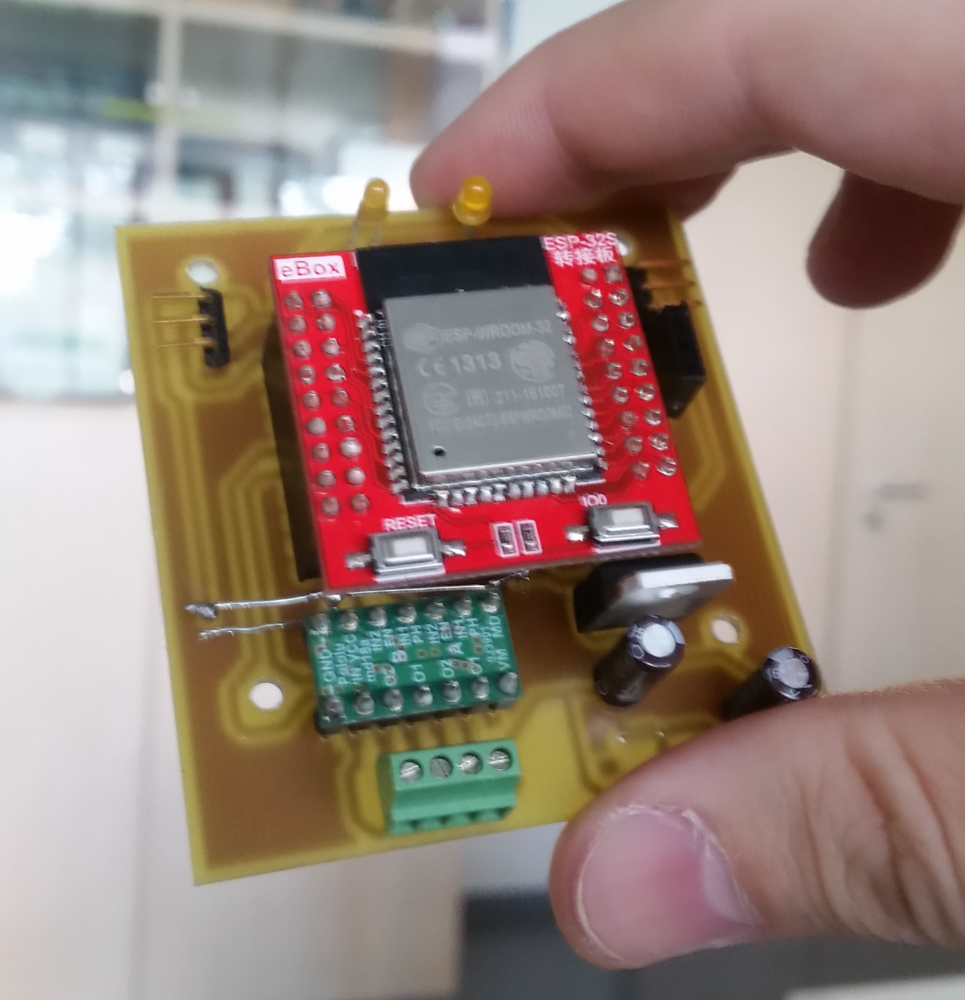

# How to build:

### 1. Frame printing:
First of all you will have to print frame from **3D_Design** folder:
1x RoverFrame
2x Wheel

PS: There are multiple formats for RoverFrame. Choose the one compatible with 3D printer.

At the end you'll have something like this:

### 2. Print electrical design (PCB)
In folder **Eagle** you will find electrical schematic and pcb design and some helpfull notes. Software used to design circuit schematic and PCB was **Eagle v6.1** and project files are under *Eagle/controldeveloper/*.
Create the PCB using a CNC machine or using *home made* method.

After you printed PCB, solder all components according to schematic and instructions from **Eagle** folder.

At the end, you'll hae something like this:

### 3. Assemble all components like in the following pictures:
!()[]

### 4. Uploading firmware to microcontroller:

In order to do this, you'll have to use the following pins

To be continued...

# Additional building tips
  1. If you will try to compile Firmware and upload it from a Windows machine, it will take almost half minute (I7 + SSD) for code to be uploaded on ESP board and even more if you have installed an antivirus with ransomware protection enabled. My advice, use Ubuntu when debugging or improving the Firmware. It will be way easy and faster.
  2. Be carefull at battery. A powerbang which provide only 800mA on output may not be be enough. Sometimes, when WiFi Radios are enabled on ESP Board, motors and ESP Board need more current feed. When those peaks are reached, ADC ports may get crazy!
  3. If something is not working, connect serial cable and check debug logs received via Serial port. It is enabled by default. 
  4. If you customize the firmware and Eagle Schematic/PCB, make sure you don't use ANALOG PINS FROM CHANNEL 2 neither DACS. Won't work when radios are enabled. Yes! When WiFi radios are enabled, only ADC pins from channel 1 are usable as ADC Input ports. Of course, you can use those pins as digital or even PWM.
