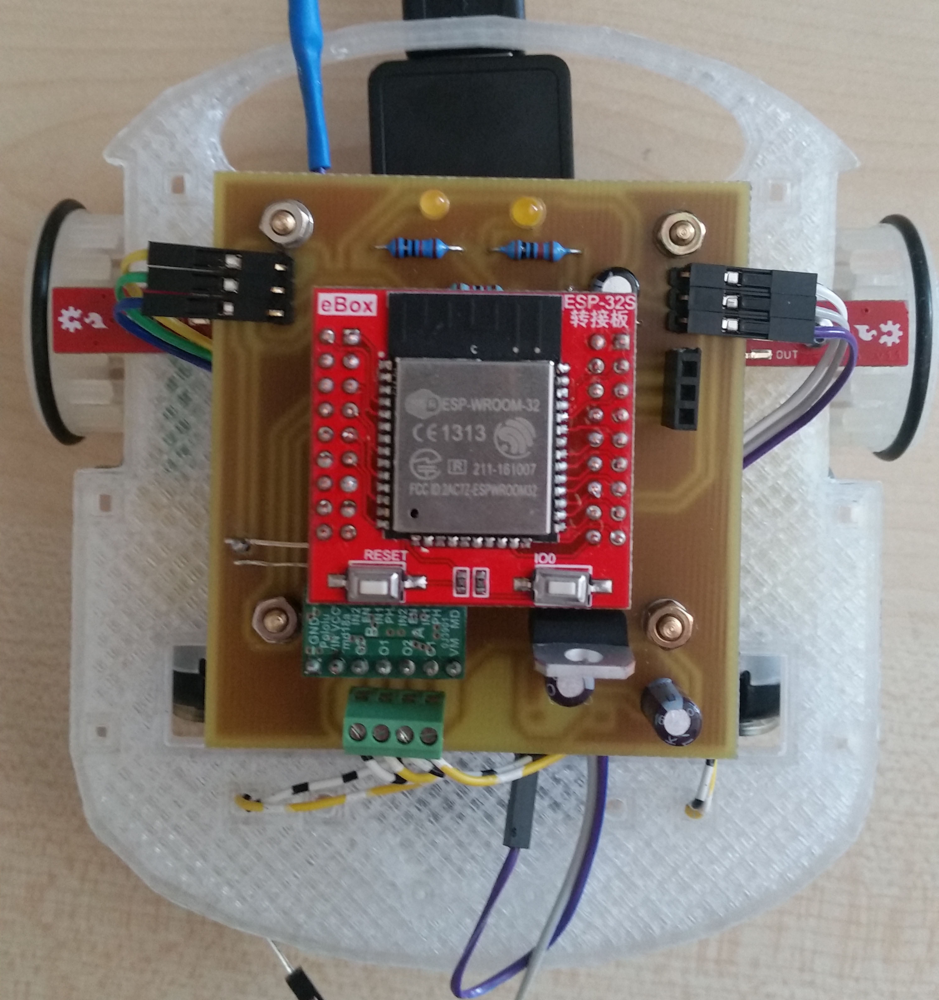
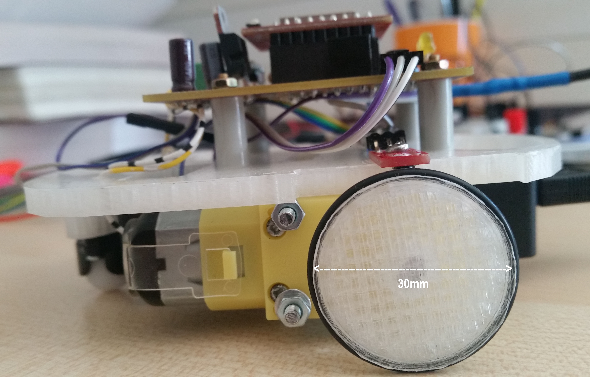
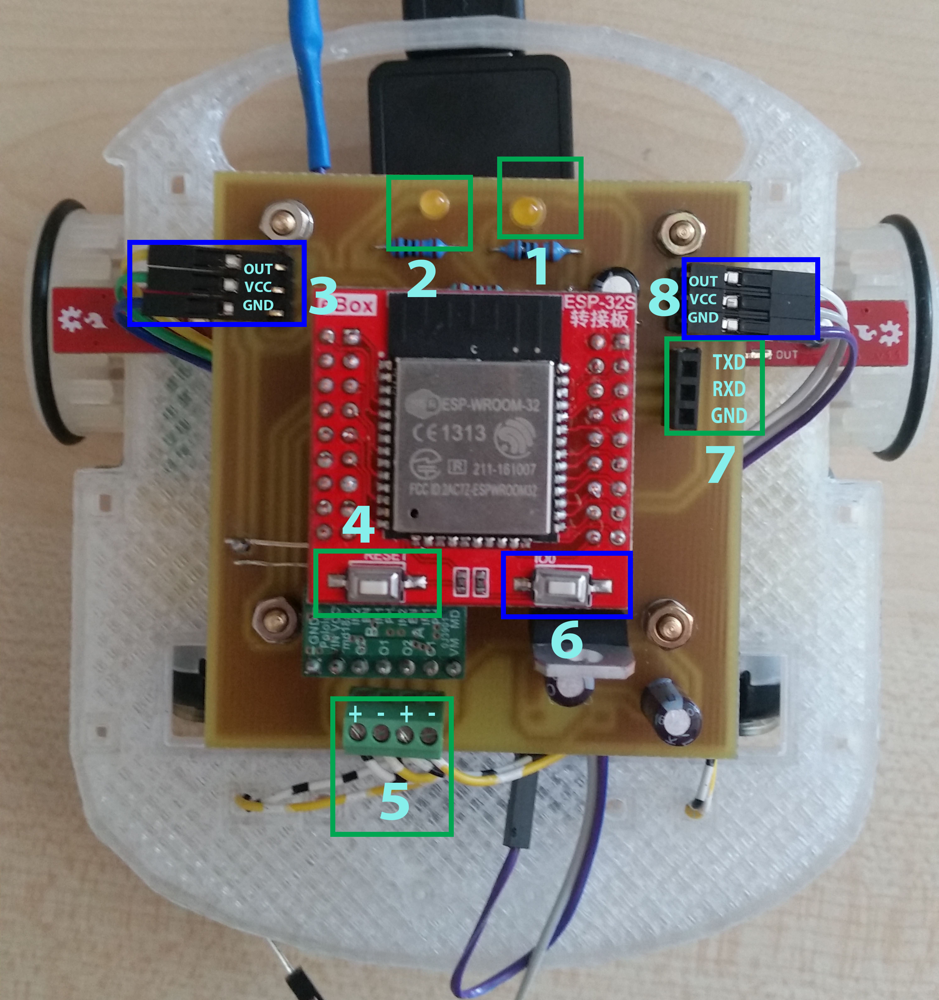
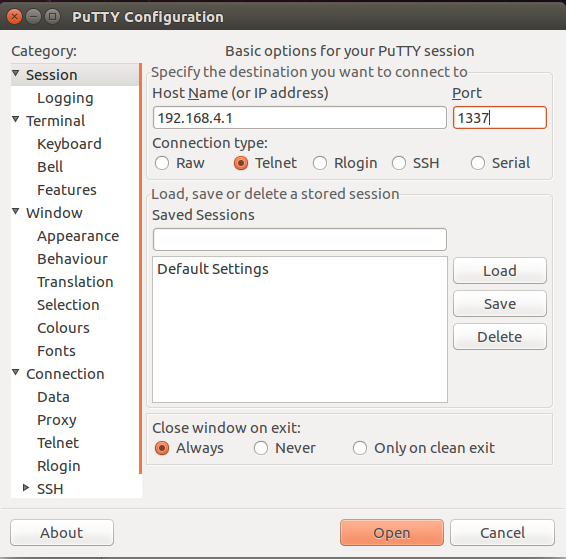
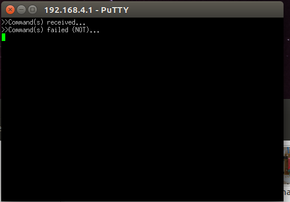
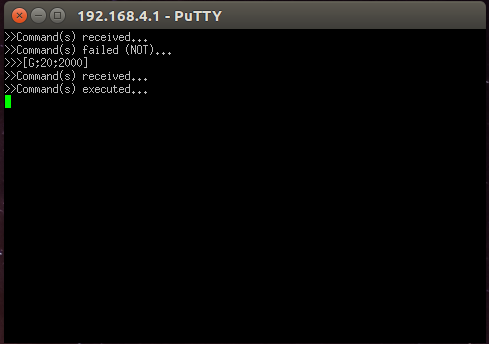

## RC Car Developement

Designing and implementing a remote controlled rover from zero to hero!

## Details:
  1. Project information: [RC_Car_WordDoc.odt](docs/RC_Car_Developement.odt)
  2. Required list of components: [here](Components.md)
  3. How to build: [here](How-to-build.md)

*Costs:* ~60EUR

## Results

## Connections 

#### 1. Connection indicator LED
This is a LED whose meant is to indicate whether there is a connection established with car or not.
It have three states:
  1. Turned off - this mean that a connection is established with car and no further incoming connections will be accepted;
  2. Blinking - No clients connected to car AP nor Sockets are oppened;
  3. Blinking faster - Clients connected to AP but no sockets oppened. If use Java developed app, possibly application is not running.

#### 2. Traffic indicator LED
This is a LED whose meant is to act like any regular ethernet traffic indicator. Whether there is a data exchange between client and car this led will blink. Efficient feedback to confirm if your data is being received by car and vice-versa.

#### 3. Left QRE1113 IR Sensor
Connector for left wheel sensor.

#### 4. RESET Button
This is a push button which will reset car. Whether connection is not responding or you're unable to connect, presh this button and program will reset.

#### 5. Motors connector
Connect motors to this socket using the given pairs. First two entries for left motor and last two entries for right motor. In case motors are reversed, just switch polarity to get the correct rotation direction. 
PS: Do not cross connections between motors!!!

#### 6. IO0
This is a push button and is used to turn microcontroller into programming mode. Whether you want to upload a new firmware, you'll have to use this button in the following way:
Push IO0 and keep it pushed >> once RESET button (don't keep it pushed) >> release IO button. Now the microcontrolled will enter on programing mode and a new firmware can be uploaded using ping pins from point 7.

#### 7. Programming connectors
This is the socket used to upload a new firmware on mictrocontroller. Pins are active only when microcontroller is turned on on programming mode using point 6 (above).
Usually you coonnect pins to a Serial-2-USB converter.
**WARNING:** Logical levels are 0-3.3V. Applying 5V may broke the board.

#### 8. Right QRE1113 IR Sensor
Connector for right wheel sensor.

**Notes:**
  * future versions have a power switch on right-bottom edge;
  * micro USB connection is in bottom layer right beside motors connector;

## How to control the car
Turn the power on by connecting cable to powerbank and swith on. After few seconds, connection led should blink indicating that car is waiting for a incomming conenction. To control the car, two connection phases are required:
1. Connecting to AP - This is the exactly like connecting to any regular router or hotspot. This is possible because car will automatically will create an Access Point (hotspot) when is powered on. Just connect to that network!
In order to do this, you will need **AP Name** and **password**. Check here for credentials: [firmware](Arduino/)
Windows instructions: https://support.microsoft.com/en-us/help/17137/windows-setting-up-wireless-network

2. After you are connected, the connection led will blink a little bit faster. Now, now we need to make sure we are connected to right network. 
The following tool is required: [putty](http://www.putty.org/) - download and install PuTTy.
Launch and fill IP address with **192.168.4.1** and port **1337** and select "Telnet" for protocol, as in the following picture:

Then click open button (bottom).

At this point communication channel should be established with car. If everything is fine, the connection led should not blink anymore and you will get the following window:

We can use this terminal to send commands to car:
For example, type **>>>[G;20;3000]** and hit *Enter*. At this point, car will give feed back when command is received and executed:

Details about commands here: [Java Commands](Java/)

At this point, you can made your own application with joysticks and stuff and use TCP sockets to send commands! Check my other repositories as I already made some C++ and Qt Wrappers for TCP Sockets. Java or C# should be easier :)

**Note:** You can also use mobile phone but use an application such as *Mobile Telnet* instead of PuTTy.
	
